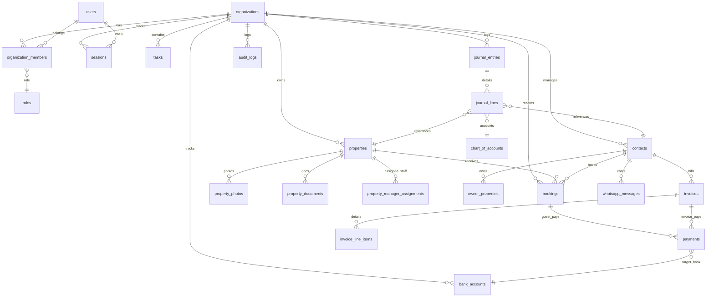

# Database Specification — Holiday Homes SaaS

> **Version**: 2.0  
> **Last Updated**: 2026-05-31  
> **Database**: PostgreSQL 16 with Prisma ORM  
> **Multi-tenancy**: Shared schema with Row-Level Security (RLS)
> **Auth Model**: In-house credentials-based authentication with stateful database sessions

---

## Table of Contents
1. [Design Principles](#1-design-principles)
2. [Multi-tenancy & Authentication](#2-multi-tenancy--authentication)
3. [Properties](#3-properties)
4. [Contacts](#4-contacts)
5. [Bookings & Sync](#5-bookings--sync)
6. [Tasks & Maintenance](#6-tasks--maintenance)
7. [Claims](#7-claims)
8. [Documents & Signatures](#8-documents--signatures)
9. [Accounting](#9-accounting)
10. [Communication](#10-communication)
11. [Workflow Engine](#11-workflow-engine)
12. [Entity Relationship Diagram](#12-entity-relationship-diagram)
13. [Index Strategy](#13-index-strategy)
14. [RLS Policies](#14-rls-policies)
15. [Migration Strategy](#15-migration-strategy)
16. [Seed Data Plan](#16-seed-data-plan)

---

## 1. Design Principles

- **UUID Primary Keys**: All tables use UUID v7 (time-ordered) for distributed-friendly, non-guessable IDs.
- **Tenant Isolation**: Every table includes `organization_id` with RLS enforced at the database level.
- **Soft Deletes**: Core operational entities use `deleted_at` (nullable timestamp) instead of hard deletes.
- **Audit Trail**: All mutations logged to the `audit_logs` table via Prisma middleware.
- **Timestamps**: All tables include `created_at` and `updated_at` (auto-managed).
- **JSONB for Flexibility**: Settings, amenities, permissions, and workflow states are stored as JSONB.
- **Decimal Precision**: All monetary values use `DECIMAL(15,2)` to support AED and USD values with precise rounding.
- **UAE Specific Compliance**: Support for DTCM permit tracking on properties and UAE VAT (5%) on invoicing.

---

## 2. Multi-tenancy & Authentication

### `organizations`
Tenant companies (holiday home operator companies).

| Column | Type | Constraints | Description |
|--------|------|-------------|-------------|
| `id` | UUID | PK, DEFAULT gen_random_uuid() | Primary key |
| `name` | VARCHAR(255) | NOT NULL | Company name |
| `slug` | VARCHAR(100) | UNIQUE, NOT NULL | URL-friendly identifier |
| `logo_url` | TEXT | NULLABLE | Company logo (R2 URL) |
| `settings` | JSONB | DEFAULT '{}' | Org-level settings (currency, timezone, tax registration number, etc.) |
| `subscription_tier` | VARCHAR(50) | NOT NULL, DEFAULT 'free' | free / starter / professional / enterprise |
| `is_active` | BOOLEAN | NOT NULL, DEFAULT true | Soft disable |
| `created_at` | TIMESTAMPTZ | NOT NULL, DEFAULT now() | |
| `updated_at` | TIMESTAMPTZ | NOT NULL, DEFAULT now() | |

**Settings JSONB structure:**
```json
{
  "base_currency": "AED",
  "timezone": "Asia/Dubai",
  "language": "en",
  "date_format": "DD/MM/YYYY",
  "trn_number": "100XXXXXXXXXXXX",
  "fiscal_year_start": "01-01",
  "management_fee_default": 15.0,
  "quote_approval_threshold": 5000,
  "maintenance_auto_assign": true,
  "whatsapp_enabled": true,
  "docusign_enabled": true,
  "multigateway_active_provider": "paytabs"
}
```

### `users`
Represents all users (system staff, admins, portal owners, portal vendors).

| Column | Type | Constraints | Description |
|--------|------|-------------|-------------|
| `id` | UUID | PK | Primary key |
| `email` | VARCHAR(320) | UNIQUE, NOT NULL | Primary login email |
| `password_hash` | VARCHAR(255) | NOT NULL | Bcrypt/Argon2 password hash |
| `first_name` | VARCHAR(100) | NOT NULL | |
| `last_name` | VARCHAR(100) | NOT NULL | |
| `phone` | VARCHAR(20) | NULLABLE | Phone number |
| `avatar_url` | TEXT | NULLABLE | Profile photo URL |
| `is_mfa_enabled` | BOOLEAN | NOT NULL, DEFAULT false | Whether MFA is active |
| `mfa_secret` | VARCHAR(255) | NULLABLE | Encrypted TOTP secret |
| `backup_codes` | JSONB | DEFAULT '[]' | Encrypted backup codes array |
| `email_verified_at` | TIMESTAMPTZ | NULLABLE | Verification timestamp |
| `verification_token` | VARCHAR(255) | NULLABLE | Verification verification code |
| `reset_password_token` | VARCHAR(255) | NULLABLE | Reset password token |
| `reset_password_expires_at`| TIMESTAMPTZ | NULLABLE | Reset password expiration |
| `is_active` | BOOLEAN | NOT NULL, DEFAULT true | |
| `last_login_at` | TIMESTAMPTZ | NULLABLE | Last login timestamp |
| `created_at` | TIMESTAMPTZ | NOT NULL, DEFAULT now() | |
| `updated_at` | TIMESTAMPTZ | NOT NULL, DEFAULT now() | |

### `sessions`
Tracks active client sessions for stateful, JWT-less cookie-based authentication.

| Column | Type | Constraints | Description |
|--------|------|-------------|-------------|
| `id` | UUID | PK | Primary key |
| `user_id` | UUID | FK → users, NOT NULL | Session owner |
| `token_hash` | VARCHAR(255) | UNIQUE, NOT NULL | Hashed session verification token |
| `ip_address` | INET | NULLABLE | Client IP address |
| `user_agent` | TEXT | NULLABLE | Browser user agent |
| `expires_at` | TIMESTAMPTZ | NOT NULL | Session expiry time |
| `created_at` | TIMESTAMPTZ | NOT NULL, DEFAULT now() | |

### `organization_members`
User-organization membership with role assignment.

| Column | Type | Constraints | Description |
|--------|------|-------------|-------------|
| `id` | UUID | PK | Primary key |
| `organization_id` | UUID | FK → organizations, NOT NULL | Tenant |
| `user_id` | UUID | FK → users, NOT NULL | Member |
| `role_id` | UUID | FK → roles, NOT NULL | Assigned role |
| `is_active` | BOOLEAN | NOT NULL, DEFAULT true | |
| `invited_by` | UUID | FK → users, NULLABLE | Who invited this member |
| `joined_at` | TIMESTAMPTZ | NULLABLE | When they accepted |
| `created_at` | TIMESTAMPTZ | NOT NULL, DEFAULT now() | |
| `updated_at` | TIMESTAMPTZ | NOT NULL, DEFAULT now() | |

**Constraints:** UNIQUE(organization_id, user_id)

### `roles`
Custom and system roles per organization.

| Column | Type | Constraints | Description |
|--------|------|-------------|-------------|
| `id` | UUID | PK | Primary key |
| `organization_id` | UUID | FK → organizations, NULLABLE | NULL = platform-level role |
| `name` | VARCHAR(100) | NOT NULL | e.g., "Property Manager" |
| `slug` | VARCHAR(100) | NOT NULL | e.g., "property_manager" |
| `description` | TEXT | NULLABLE | Role description |
| `permissions` | JSONB | NOT NULL, DEFAULT '[]' | Array of permission strings |
| `is_system_role` | BOOLEAN | NOT NULL, DEFAULT false | Cannot be deleted if true |
| `created_at` | TIMESTAMPTZ | NOT NULL, DEFAULT now() | |

**Constraints:** UNIQUE(organization_id, slug)

### `audit_logs`
Immutable audit trail. No UPDATE or DELETE allowed.

| Column | Type | Constraints | Description |
|--------|------|-------------|-------------|
| `id` | UUID | PK | Primary key |
| `organization_id` | UUID | FK → organizations, NOT NULL | Tenant |
| `user_id` | UUID | FK → users, NULLABLE | Who performed the action |
| `action` | VARCHAR(50) | NOT NULL | CREATE, UPDATE, DELETE, LOGIN, EXPORT, SIGN, SYNC |
| `entity_type` | VARCHAR(100) | NOT NULL | e.g., "property", "booking", "invoice" |
| `entity_id` | UUID | NULLABLE | ID of affected entity |
| `old_values` | JSONB | NULLABLE | Previous values (for UPDATE) |
| `new_values` | JSONB | NULLABLE | New values |
| `ip_address` | INET | NULLABLE | Client IP |
| `user_agent` | TEXT | NULLABLE | Browser/client info |
| `metadata` | JSONB | DEFAULT '{}' | Additional context |
| `created_at` | TIMESTAMPTZ | NOT NULL, DEFAULT now() | |

---

## 3. Properties

### `properties`
Core property entity. In accordance with UAE requirements, each property represents a single physical unit.

| Column | Type | Constraints | Description |
|--------|------|-------------|-------------|
| `id` | UUID | PK | Primary key |
| `organization_id` | UUID | FK → organizations, NOT NULL | Tenant |
| `name` | VARCHAR(255) | NOT NULL | Property title |
| `property_type` | VARCHAR(50) | NOT NULL | villa, apartment, penthouse, studio |
| `address_line_1` | VARCHAR(500) | NOT NULL | Street address |
| `address_line_2` | VARCHAR(500) | NULLABLE | Building name / unit number |
| `city` | VARCHAR(100) | NOT NULL | e.g., "Dubai" |
| `state` | VARCHAR(100) | NULLABLE | e.g., "Dubai" |
| `country` | VARCHAR(100) | NOT NULL | e.g., "United Arab Emirates" |
| `postal_code` | VARCHAR(20) | NULLABLE | |
| `latitude` | DECIMAL(10,8) | NULLABLE | GPS latitude |
| `longitude` | DECIMAL(11,8) | NULLABLE | GPS longitude |
| `bedrooms` | INTEGER | NOT NULL, DEFAULT 1 | |
| `bathrooms` | INTEGER | NOT NULL, DEFAULT 1 | |
| `max_guests` | INTEGER | NOT NULL, DEFAULT 2 | |
| `area_sqm` | DECIMAL(10,2) | NULLABLE | Area in square meters |
| `description` | TEXT | NULLABLE | Detailed description |
| `amenities` | JSONB | DEFAULT '[]' | Array of amenity strings |
| `dtcm_permit_number` | VARCHAR(100) | NULLABLE | Dubai Tourism (DTCM) Permit Number |
| `dtcm_permit_expiry` | DATE | NULLABLE | DTCM Permit Expiry Date |
| `status` | VARCHAR(50) | NOT NULL, DEFAULT 'draft' | draft, onboarding, active, inactive, archived |
| `owner_contact_id` | UUID | FK → contacts, NULLABLE | Primary owner |
| `managed_since` | DATE | NULLABLE | Management start date |
| `created_by` | UUID | FK → users, NOT NULL | |
| `deleted_at` | TIMESTAMPTZ | NULLABLE | Soft delete |
| `created_at` | TIMESTAMPTZ | NOT NULL, DEFAULT now() | |
| `updated_at` | TIMESTAMPTZ | NOT NULL, DEFAULT now() | |

### `property_photos`

| Column | Type | Constraints | Description |
|--------|------|-------------|-------------|
| `id` | UUID | PK | |
| `property_id` | UUID | FK → properties, NOT NULL | |
| `organization_id` | UUID | FK → organizations, NOT NULL | RLS |
| `url` | TEXT | NOT NULL | Public URL (signed) |
| `storage_key` | VARCHAR(500) | NOT NULL | R2 object key |
| `caption` | VARCHAR(255) | NULLABLE | |
| `sort_order` | INTEGER | NOT NULL, DEFAULT 0 | Display order |
| `is_primary` | BOOLEAN | NOT NULL, DEFAULT false | Hero image |
| `uploaded_by` | UUID | FK → users, NOT NULL | |
| `created_at` | TIMESTAMPTZ | NOT NULL, DEFAULT now() | |

### `property_documents`

| Column | Type | Constraints | Description |
|--------|------|-------------|-------------|
| `id` | UUID | PK | |
| `property_id` | UUID | FK → properties, NOT NULL | |
| `organization_id` | UUID | FK → organizations, NOT NULL | |
| `name` | VARCHAR(255) | NOT NULL | File name |
| `document_type` | VARCHAR(50) | NOT NULL | contract, permit, license, insurance, inspection |
| `storage_key` | VARCHAR(500) | NOT NULL | R2 key |
| `file_size` | BIGINT | NOT NULL | Bytes |
| `mime_type` | VARCHAR(100) | NOT NULL | |
| `uploaded_by` | UUID | FK → users, NOT NULL | |
| `expiry_date` | DATE | NULLABLE | For permits/licenses |
| `created_at` | TIMESTAMPTZ | NOT NULL, DEFAULT now() | |

### `property_manager_assignments`

| Column | Type | Constraints | Description |
|--------|------|-------------|-------------|
| `id` | UUID | PK | |
| `property_id` | UUID | FK → properties, NOT NULL | |
| `user_id` | UUID | FK → users, NOT NULL | Property Manager |
| `organization_id` | UUID | FK → organizations, NOT NULL | |
| `is_primary` | BOOLEAN | NOT NULL, DEFAULT false | Primary manager |
| `assigned_at` | TIMESTAMPTZ | NOT NULL, DEFAULT now() | |

**Constraints:** UNIQUE(property_id, user_id)

---

## 4. Contacts

### `contacts`
Unified contact table for Owners, Vendors, Guests.

| Column | Type | Constraints | Description |
|--------|------|-------------|-------------|
| `id` | UUID | PK | |
| `organization_id` | UUID | FK → organizations, NOT NULL | |
| `contact_type` | VARCHAR(50) | NOT NULL | owner, vendor, guest, other |
| `first_name` | VARCHAR(100) | NOT NULL | |
| `last_name` | VARCHAR(100) | NOT NULL | |
| `email` | VARCHAR(320) | NULLABLE | |
| `phone` | VARCHAR(20) | NULLABLE | |
| `whatsapp_number` | VARCHAR(20) | NULLABLE | WhatsApp-specific number |
| `company_name` | VARCHAR(255) | NULLABLE | For vendors/corporate owners |
| `address` | TEXT | NULLABLE | |
| `trn` | VARCHAR(15) | NULLABLE | Tax Registration Number (vendors) |
| `bank_details` | JSONB | NULLABLE | Vendor/Owner bank wire details |
| `notes` | TEXT | NULLABLE | Internal notes |
| `is_active` | BOOLEAN | NOT NULL, DEFAULT true | |
| `portal_user_id` | UUID | FK → users, NULLABLE | Linked portal user |
| `deleted_at` | TIMESTAMPTZ | NULLABLE | |
| `created_at` | TIMESTAMPTZ | NOT NULL, DEFAULT now() | |
| `updated_at` | TIMESTAMPTZ | NOT NULL, DEFAULT now() | |

### `owner_properties`
Relationship between owners and properties.

| Column | Type | Constraints | Description |
|--------|------|-------------|-------------|
| `id` | UUID | PK | |
| `owner_id` | UUID | FK → contacts, NOT NULL | Must be contact_type = 'owner' |
| `property_id` | UUID | FK → properties, NOT NULL | |
| `organization_id` | UUID | FK → organizations, NOT NULL | |
| `ownership_percentage` | DECIMAL(5,2) | NOT NULL, DEFAULT 100.00 | |
| `management_fee_pct` | DECIMAL(5,2) | NOT NULL, DEFAULT 15.00 | Management fee |
| `contract_start` | DATE | NULLABLE | |
| `contract_end` | DATE | NULLABLE | |
| `docusign_envelope_id` | VARCHAR(255) | NULLABLE | E-signed contract envelope |
| `created_at` | TIMESTAMPTZ | NOT NULL, DEFAULT now() | |

### `vendor_categories`

| Column | Type | Constraints | Description |
|--------|------|-------------|-------------|
| `id` | UUID | PK | |
| `organization_id` | UUID | FK → organizations, NOT NULL | |
| `name` | VARCHAR(100) | NOT NULL | plumbing, cleaning, HVAC, etc. |
| `created_at` | TIMESTAMPTZ | NOT NULL, DEFAULT now() | |

**Constraints:** UNIQUE(organization_id, name)

### `vendor_category_assignments`

| Column | Type | Constraints | Description |
|--------|------|-------------|-------------|
| `vendor_id` | UUID | FK → contacts, NOT NULL | |
| `category_id` | UUID | FK → vendor_categories, NOT NULL | |

**Constraints:** PK(vendor_id, category_id)

---

## 5. Bookings & Sync

### `bookings`
Native booking engine records, synced with the Uplisting Channel Manager.

| Column | Type | Constraints | Description |
|--------|------|-------------|-------------|
| `id` | UUID | PK | Primary key |
| `organization_id` | UUID | FK → organizations, NOT NULL | Tenant |
| `property_id` | UUID | FK → properties, NOT NULL | Linked property unit |
| `guest_contact_id` | UUID | FK → contacts, NOT NULL | Guest contact details |
| `check_in` | DATE | NOT NULL | Check-in date |
| `check_out` | DATE | NOT NULL | Check-out date |
| `status` | VARCHAR(50) | NOT NULL | draft, confirmed, checked_in, checked_out, cancelled |
| `source` | VARCHAR(50) | NOT NULL | direct, airbnb, booking, vrbo, other |
| `external_booking_id` | VARCHAR(255) | NULLABLE | Uplisting / OTA reservation ID |
| `gross_amount` | DECIMAL(15,2) | NOT NULL | Base booking revenue |
| `security_deposit` | DECIMAL(15,2) | NOT NULL, DEFAULT 0.00 | Refundable deposit held |
| `tax_amount` | DECIMAL(15,2) | NOT NULL, DEFAULT 0.00 | VAT amount |
| `total_amount` | DECIMAL(15,2) | NOT NULL | Base + tax + fees |
| `currency` | VARCHAR(3) | NOT NULL, DEFAULT 'AED' | Currency (AED or USD) |
| `uplisting_synced_at` | TIMESTAMPTZ | NULLABLE | Timestamp of last sync |
| `created_at` | TIMESTAMPTZ | NOT NULL, DEFAULT now() | |
| `updated_at` | TIMESTAMPTZ | NOT NULL, DEFAULT now() | |

### `uplisting_sync_logs`
Logs of bi-directional API operations with Uplisting.

| Column | Type | Constraints | Description |
|--------|------|-------------|-------------|
| `id` | UUID | PK | |
| `organization_id` | UUID | FK → organizations, NOT NULL | |
| `direction` | VARCHAR(10) | NOT NULL | inbound, outbound |
| `event_type` | VARCHAR(100) | NOT NULL | e.g. booking.created, calendar.blocked |
| `payload` | JSONB | NOT NULL | Raw JSON payload |
| `status` | VARCHAR(50) | NOT NULL | success, failed |
| `error_message` | TEXT | NULLABLE | |
| `created_at` | TIMESTAMPTZ | NOT NULL, DEFAULT now() | |

---

## 6. Tasks & Maintenance

### `tasks`

| Column | Type | Constraints | Description |
|--------|------|-------------|-------------|
| `id` | UUID | PK | |
| `organization_id` | UUID | FK → organizations, NOT NULL | |
| `title` | VARCHAR(255) | NOT NULL | |
| `description` | TEXT | NULLABLE | |
| `task_type` | VARCHAR(50) | NOT NULL | inspection, cleaning, check_in, check_out, general |
| `priority` | VARCHAR(20) | NOT NULL, DEFAULT 'medium' | low, medium, high, urgent |
| `status` | VARCHAR(50) | NOT NULL, DEFAULT 'pending' | pending, assigned, in_progress, completed, verified, cancelled |
| `property_id` | UUID | FK → properties, NULLABLE | |
| `assigned_to` | UUID | FK → users, NULLABLE | Internal staff |
| `assigned_vendor_id` | UUID | FK → contacts, NULLABLE | External vendor |
| `due_date` | TIMESTAMPTZ | NULLABLE | |
| `completed_at` | TIMESTAMPTZ | NULLABLE | |
| `completed_by` | UUID | FK → users, NULLABLE | |
| `recurrence_rule` | VARCHAR(255) | NULLABLE | iCal RRULE for recurring tasks |
| `parent_task_id` | UUID | FK → tasks, NULLABLE | Points to template if recurring |
| `created_by` | UUID | FK → users, NOT NULL | |
| `deleted_at` | TIMESTAMPTZ | NULLABLE | |
| `created_at` | TIMESTAMPTZ | NOT NULL, DEFAULT now() | |
| `updated_at` | TIMESTAMPTZ | NOT NULL, DEFAULT now() | |

### `task_comments`

| Column | Type | Constraints | Description |
|--------|------|-------------|-------------|
| `id` | UUID | PK | |
| `task_id` | UUID | FK → tasks, NOT NULL | |
| `organization_id` | UUID | FK → organizations, NOT NULL | |
| `user_id` | UUID | FK → users, NOT NULL | |
| `content` | TEXT | NOT NULL | |
| `created_at` | TIMESTAMPTZ | NOT NULL, DEFAULT now() | |

### `task_attachments`

| Column | Type | Constraints | Description |
|--------|------|-------------|-------------|
| `id` | UUID | PK | |
| `task_id` | UUID | FK → tasks, NOT NULL | |
| `organization_id` | UUID | FK → organizations, NOT NULL | |
| `storage_key` | VARCHAR(500) | NOT NULL | R2 key |
| `file_name` | VARCHAR(255) | NOT NULL | |
| `mime_type` | VARCHAR(100) | NOT NULL | |
| `file_size` | BIGINT | NOT NULL | |
| `uploaded_by` | UUID | FK → users, NOT NULL | |
| `created_at` | TIMESTAMPTZ | NOT NULL, DEFAULT now() | |

### `maintenance_requests`

| Column | Type | Constraints | Description |
|--------|------|-------------|-------------|
| `id` | UUID | PK | |
| `organization_id` | UUID | FK → organizations, NOT NULL | |
| `property_id` | UUID | FK → properties, NOT NULL | |
| `title` | VARCHAR(255) | NOT NULL | |
| `description` | TEXT | NOT NULL | |
| `category` | VARCHAR(50) | NOT NULL | plumbing, electrical, HVAC, appliance, structural |
| `priority` | VARCHAR(20) | NOT NULL, DEFAULT 'medium' | low, medium, high, emergency |
| `status` | VARCHAR(50) | NOT NULL, DEFAULT 'reported' | reported, triaged, quoted, approved, in_progress, completed, closed |
| `reported_by_user_id` | UUID | FK → users, NULLABLE | If staff reported |
| `reported_by_contact_id` | UUID | FK → contacts, NULLABLE | If owner/guest reported |
| `assigned_vendor_id` | UUID | FK → contacts, NULLABLE | |
| `estimated_cost` | DECIMAL(15,2) | NULLABLE | |
| `actual_cost` | DECIMAL(15,2) | NULLABLE | |
| `currency` | VARCHAR(3) | NOT NULL, DEFAULT 'AED' | AED or USD |
| `scheduled_date` | DATE | NULLABLE | |
| `completed_at` | TIMESTAMPTZ | NULLABLE | |
| `closed_at` | TIMESTAMPTZ | NULLABLE | |
| `created_by` | UUID | FK → users, NOT NULL | |
| `deleted_at` | TIMESTAMPTZ | NULLABLE | |
| `created_at` | TIMESTAMPTZ | NOT NULL, DEFAULT now() | |
| `updated_at` | TIMESTAMPTZ | NOT NULL, DEFAULT now() | |

### `maintenance_quotes`

| Column | Type | Constraints | Description |
|--------|------|-------------|-------------|
| `id` | UUID | PK | |
| `maintenance_request_id` | UUID | FK → maintenance_requests, NOT NULL | |
| `organization_id` | UUID | FK → organizations, NOT NULL | |
| `vendor_id` | UUID | FK → contacts, NOT NULL | |
| `amount` | DECIMAL(15,2) | NOT NULL | |
| `currency` | VARCHAR(3) | NOT NULL, DEFAULT 'AED' | |
| `description` | TEXT | NULLABLE | Scope of work details |
| `valid_until` | DATE | NULLABLE | Quote expiry |
| `status` | VARCHAR(50) | NOT NULL, DEFAULT 'pending' | pending, accepted, rejected, expired |
| `reviewed_by` | UUID | FK → users, NULLABLE | |
| `reviewed_at` | TIMESTAMPTZ | NULLABLE | |
| `created_at` | TIMESTAMPTZ | NOT NULL, DEFAULT now() | |

### `work_orders`

| Column | Type | Constraints | Description |
|--------|------|-------------|-------------|
| `id` | UUID | PK | |
| `organization_id` | UUID | FK → organizations, NOT NULL | |
| `maintenance_request_id` | UUID | FK → maintenance_requests, NULLABLE | |
| `vendor_id` | UUID | FK → contacts, NOT NULL | |
| `property_id` | UUID | FK → properties, NOT NULL | |
| `description` | TEXT | NOT NULL | |
| `status` | VARCHAR(50) | NOT NULL, DEFAULT 'created' | created, sent, accepted, declined, scheduled, in_progress, completed, invoiced, paid |
| `scheduled_start` | TIMESTAMPTZ | NULLABLE | |
| `scheduled_end` | TIMESTAMPTZ | NULLABLE | |
| `actual_start` | TIMESTAMPTZ | NULLABLE | |
| `actual_end` | TIMESTAMPTZ | NULLABLE | |
| `total_cost` | DECIMAL(15,2) | NULLABLE | |
| `currency` | VARCHAR(3) | NOT NULL, DEFAULT 'AED' | |
| `notes` | TEXT | NULLABLE | |
| `vendor_notes` | TEXT | NULLABLE | |
| `created_by` | UUID | FK → users, NOT NULL | |
| `created_at` | TIMESTAMPTZ | NOT NULL, DEFAULT now() | |
| `updated_at` | TIMESTAMPTZ | NOT NULL, DEFAULT now() | |

---

## 7. Claims

### `claims`

| Column | Type | Constraints | Description |
|--------|------|-------------|-------------|
| `id` | UUID | PK | |
| `organization_id` | UUID | FK → organizations, NOT NULL | |
| `property_id` | UUID | FK → properties, NOT NULL | |
| `title` | VARCHAR(255) | NOT NULL | |
| `description` | TEXT | NOT NULL | |
| `claim_type` | VARCHAR(50) | NOT NULL | damage, insurance, deposit |
| `status` | VARCHAR(50) | NOT NULL, DEFAULT 'draft' | draft, submitted, under_review, approved, rejected, settled |
| `amount_claimed` | DECIMAL(15,2) | NOT NULL | |
| `amount_approved` | DECIMAL(15,2) | NULLABLE | |
| `currency` | VARCHAR(3) | NOT NULL, DEFAULT 'AED' | AED or USD |
| `claimant_contact_id` | UUID | FK → contacts, NULLABLE | |
| `reviewer_user_id` | UUID | FK → users, NULLABLE | |
| `resolution_notes` | TEXT | NULLABLE | |
| `submitted_at` | TIMESTAMPTZ | NULLABLE | |
| `resolved_at` | TIMESTAMPTZ | NULLABLE | |
| `created_by` | UUID | FK → users, NOT NULL | |
| `deleted_at` | TIMESTAMPTZ | NULLABLE | |
| `created_at` | TIMESTAMPTZ | NOT NULL, DEFAULT now() | |
| `updated_at` | TIMESTAMPTZ | NOT NULL, DEFAULT now() | |

### `claim_evidence`

| Column | Type | Constraints | Description |
|--------|------|-------------|-------------|
| `id` | UUID | PK | |
| `claim_id` | UUID | FK → claims, NOT NULL | |
| `organization_id` | UUID | FK → organizations, NOT NULL | |
| `storage_key` | VARCHAR(500) | NOT NULL | |
| `file_name` | VARCHAR(255) | NOT NULL | |
| `file_size` | BIGINT | NOT NULL | |
| `mime_type` | VARCHAR(100) | NOT NULL | |
| `description` | TEXT | NULLABLE | |
| `uploaded_by` | UUID | FK → users, NOT NULL | |
| `created_at` | TIMESTAMPTZ | NOT NULL, DEFAULT now() | |

---

## 8. Documents & Signatures

### `documents`

| Column | Type | Constraints | Description |
|--------|------|-------------|-------------|
| `id` | UUID | PK | |
| `organization_id` | UUID | FK → organizations, NOT NULL | |
| `name` | VARCHAR(255) | NOT NULL | |
| `document_type` | VARCHAR(50) | NOT NULL | contract, agreement, invoice, receipt, permit, legal |
| `entity_type` | VARCHAR(100) | NULLABLE | Polymorphic: property, contact, claim, booking |
| `entity_id` | UUID | NULLABLE | ID of linked entity |
| `storage_key` | VARCHAR(500) | NOT NULL | R2 key |
| `file_size` | BIGINT | NOT NULL | |
| `mime_type` | VARCHAR(100) | NOT NULL | |
| `version` | INTEGER | NOT NULL, DEFAULT 1 | |
| `is_signed` | BOOLEAN | NOT NULL, DEFAULT false | |
| `docusign_envelope_id` | VARCHAR(255) | NULLABLE | |
| `uploaded_by` | UUID | FK → users, NOT NULL | |
| `deleted_at` | TIMESTAMPTZ | NULLABLE | |
| `created_at` | TIMESTAMPTZ | NOT NULL, DEFAULT now() | |
| `updated_at` | TIMESTAMPTZ | NOT NULL, DEFAULT now() | |

### `docusign_envelopes`

| Column | Type | Constraints | Description |
|--------|------|-------------|-------------|
| `id` | UUID | PK | |
| `organization_id` | UUID | FK → organizations, NOT NULL | |
| `envelope_id` | VARCHAR(255) | UNIQUE, NOT NULL | DocuSign envelope ID |
| `document_id` | UUID | FK → documents, NULLABLE | |
| `status` | VARCHAR(50) | NOT NULL | sent, delivered, signed, completed, voided, declined |
| `signer_email` | VARCHAR(320) | NOT NULL | |
| `signer_name` | VARCHAR(200) | NOT NULL | |
| `sent_at` | TIMESTAMPTZ | NULLABLE | |
| `completed_at` | TIMESTAMPTZ | NULLABLE | |
| `declined_reason` | TEXT | NULLABLE | |
| `created_at` | TIMESTAMPTZ | NOT NULL, DEFAULT now() | |
| `updated_at` | TIMESTAMPTZ | NOT NULL, DEFAULT now() | |

---

## 9. Accounting

### `bank_accounts`
Tracks bank account records (both trust accounts and standard operating accounts).

| Column | Type | Constraints | Description |
|--------|------|-------------|-------------|
| `id` | UUID | PK | Primary key |
| `organization_id` | UUID | FK → organizations, NOT NULL | Tenant |
| `account_name` | VARCHAR(255) | NOT NULL | e.g. "Main Trust Account" |
| `account_number` | VARCHAR(100) | NOT NULL | |
| `iban` | VARCHAR(50) | NULLABLE | IBAN for UAE transfers |
| `bank_name` | VARCHAR(100) | NOT NULL | e.g. "Emirates NBD" |
| `currency` | VARCHAR(3) | NOT NULL, DEFAULT 'AED' | AED or USD |
| `is_trust_account` | BOOLEAN | NOT NULL, DEFAULT false | Strict segregation marker |
| `current_balance` | DECIMAL(15,2) | NOT NULL, DEFAULT 0.00 | Current computed ledger balance |
| `created_at` | TIMESTAMPTZ | NOT NULL, DEFAULT now() | |
| `updated_at` | TIMESTAMPTZ | NOT NULL, DEFAULT now() | |

### `chart_of_accounts`

| Column | Type | Constraints | Description |
|--------|------|-------------|-------------|
| `id` | UUID | PK | |
| `organization_id` | UUID | FK → organizations, NOT NULL | |
| `code` | VARCHAR(20) | NOT NULL | e.g., "1010", "2020", "4000" |
| `name` | VARCHAR(255) | NOT NULL | e.g., "Guest Trust Cash", "Management Fee Revenue" |
| `account_type` | VARCHAR(50) | NOT NULL | asset, liability, equity, revenue, expense, trust_asset, trust_liability |
| `parent_id` | UUID | FK → chart_of_accounts, NULLABLE | Parent account node |
| `is_system_account` | BOOLEAN | NOT NULL, DEFAULT false | Protects system-critical codes |
| `is_active` | BOOLEAN | NOT NULL, DEFAULT true | |
| `created_at` | TIMESTAMPTZ | NOT NULL, DEFAULT now() | |

**Constraints:** UNIQUE(organization_id, code)

### `journal_entries`
Double-entry bookkeeping header.

| Column | Type | Constraints | Description |
|--------|------|-------------|-------------|
| `id` | UUID | PK | |
| `organization_id` | UUID | FK → organizations, NOT NULL | |
| `entry_number` | VARCHAR(50) | NOT NULL | JE-YYYY-XXXXX |
| `entry_date` | DATE | NOT NULL | |
| `description` | TEXT | NOT NULL | |
| `currency` | VARCHAR(3) | NOT NULL, DEFAULT 'AED' | Currency of transaction |
| `exchange_rate` | DECIMAL(12,6) | NOT NULL, DEFAULT 1.000000 | Multiplier to get org base currency |
| `reference_type` | VARCHAR(50) | NULLABLE | booking, invoice, payment, expense |
| `reference_id` | UUID | NULLABLE | FK of trigger entity |
| `status` | VARCHAR(50) | NOT NULL, DEFAULT 'posted' | posted, voided |
| `posted_by` | UUID | FK → users, NOT NULL | |
| `created_at` | TIMESTAMPTZ | NOT NULL, DEFAULT now() | |

### `journal_lines`
Debit/credit rows. Balance check: Sum(debits) = Sum(credits) on corresponding header.

| Column | Type | Constraints | Description |
|--------|------|-------------|-------------|
| `id` | UUID | PK | |
| `journal_entry_id` | UUID | FK → journal_entries, NOT NULL | |
| `organization_id` | UUID | FK → organizations, NOT NULL | |
| `account_id` | UUID | FK → chart_of_accounts, NOT NULL | |
| `debit_amount` | DECIMAL(15,2) | NOT NULL, DEFAULT 0.00 | In transaction currency |
| `credit_amount` | DECIMAL(15,2) | NOT NULL, DEFAULT 0.00 | In transaction currency |
| `debit_base` | DECIMAL(15,2) | NOT NULL, DEFAULT 0.00 | In organization base currency |
| `credit_base` | DECIMAL(15,2) | NOT NULL, DEFAULT 0.00 | In organization base currency |
| `description` | VARCHAR(500) | NULLABLE | Line annotation |
| `property_id` | UUID | FK → properties, NULLABLE | Property tracking (NOI) |
| `contact_id` | UUID | FK → contacts, NULLABLE | Linked Owner/Vendor/Guest |
| `created_at` | TIMESTAMPTZ | NOT NULL, DEFAULT now() | |

**Constraints:** Check `(debit_amount = 0 AND credit_amount > 0) OR (debit_amount > 0 AND credit_amount = 0)`

### `invoices`
Supports UAE VAT 5% requirements.

| Column | Type | Constraints | Description |
|--------|------|-------------|-------------|
| `id` | UUID | PK | |
| `organization_id` | UUID | FK → organizations, NOT NULL | |
| `invoice_number` | VARCHAR(50) | NOT NULL | INV-YYYY-XXXXX |
| `type` | VARCHAR(50) | NOT NULL | receivable (we bill), payable (vendor bill) |
| `contact_id` | UUID | FK → contacts, NOT NULL | Recipient/Sender |
| `property_id` | UUID | FK → properties, NULLABLE | |
| `status` | VARCHAR(50) | NOT NULL, DEFAULT 'draft' | draft, sent, partially_paid, paid, overdue, voided |
| `subtotal` | DECIMAL(15,2) | NOT NULL | Excludes VAT |
| `vat_amount` | DECIMAL(15,2) | NOT NULL, DEFAULT 0.00 | 5% UAE standard VAT |
| `total` | DECIMAL(15,2) | NOT NULL | Subtotal + VAT |
| `currency` | VARCHAR(3) | NOT NULL, DEFAULT 'AED' | AED or USD |
| `exchange_rate` | DECIMAL(12,6) | NOT NULL, DEFAULT 1.000000 | Converter to AED |
| `issue_date` | DATE | NOT NULL | |
| `due_date` | DATE | NOT NULL | |
| `paid_amount` | DECIMAL(15,2) | NOT NULL, DEFAULT 0.00 | |
| `paid_at` | TIMESTAMPTZ | NULLABLE | |
| `notes` | TEXT | NULLABLE | |
| `journal_entry_id` | UUID | FK → journal_entries, NULLABLE | |
| `created_by` | UUID | FK → users, NOT NULL | |
| `deleted_at` | TIMESTAMPTZ | NULLABLE | |
| `created_at` | TIMESTAMPTZ | NOT NULL, DEFAULT now() | |
| `updated_at` | TIMESTAMPTZ | NOT NULL, DEFAULT now() | |

### `invoice_line_items`

| Column | Type | Constraints | Description |
|--------|------|-------------|-------------|
| `id` | UUID | PK | |
| `invoice_id` | UUID | FK → invoices, NOT NULL | |
| `organization_id` | UUID | FK → organizations, NOT NULL | |
| `description` | VARCHAR(500) | NOT NULL | |
| `quantity` | DECIMAL(10,2) | NOT NULL, DEFAULT 1.00 | |
| `unit_price` | DECIMAL(15,2) | NOT NULL | |
| `vat_rate` | DECIMAL(5,2) | NOT NULL, DEFAULT 5.00 | VAT rate (percentage) |
| `vat_amount` | DECIMAL(15,2) | NOT NULL, DEFAULT 0.00 | VAT amount |
| `amount` | DECIMAL(15,2) | NOT NULL | quantity * unit_price |
| `account_id` | UUID | FK → chart_of_accounts, NULLABLE | |
| `sort_order` | INTEGER | NOT NULL, DEFAULT 0 | |
| `created_at` | TIMESTAMPTZ | NOT NULL, DEFAULT now() | |

### `payments`

| Column | Type | Constraints | Description |
|--------|------|-------------|-------------|
| `id` | UUID | PK | |
| `organization_id` | UUID | FK → organizations, NOT NULL | |
| `invoice_id` | UUID | FK → invoices, NULLABLE | Linked invoice |
| `booking_id` | UUID | FK → bookings, NULLABLE | Linked booking (guest payment) |
| `bank_account_id`| UUID | FK → bank_accounts, NOT NULL | Targeted bank account |
| `amount` | DECIMAL(15,2) | NOT NULL | |
| `currency` | VARCHAR(3) | NOT NULL, DEFAULT 'AED' | |
| `payment_method` | VARCHAR(50) | NOT NULL | bank_transfer, cash, credit_card, link_payment |
| `payment_gateway` | VARCHAR(50) | NULLABLE | stripe, paytabs, checkout |
| `gateway_transaction_id`| VARCHAR(255) | NULLABLE | |
| `payment_date` | DATE | NOT NULL | |
| `reference` | VARCHAR(255) | NULLABLE | Transaction reference |
| `journal_entry_id` | UUID | FK → journal_entries, NULLABLE | |
| `recorded_by` | UUID | FK → users, NOT NULL | |
| `created_at` | TIMESTAMPTZ | NOT NULL, DEFAULT now() | |

### `owner_statements`
Owner statements showing monthly bookings, expenses, management fee, and net payout.

| Column | Type | Constraints | Description |
|--------|------|-------------|-------------|
| `id` | UUID | PK | |
| `organization_id` | UUID | FK → organizations, NOT NULL | |
| `owner_contact_id`| UUID | FK → contacts, NOT NULL | Owner recipient |
| `property_id` | UUID | FK → properties, NOT NULL | Single property unit |
| `period_start` | DATE | NOT NULL | |
| `period_end` | DATE | NOT NULL | |
| `total_revenue` | DECIMAL(15,2) | NOT NULL | Booking income in base currency |
| `total_expenses` | DECIMAL(15,2) | NOT NULL | Maintenance costs |
| `management_fee` | DECIMAL(15,2) | NOT NULL | |
| `net_amount` | DECIMAL(15,2) | NOT NULL | Payout balance |
| `currency` | VARCHAR(3) | NOT NULL, DEFAULT 'AED' | AED or USD |
| `line_items` | JSONB | NOT NULL, DEFAULT '[]' | JSON list of bookings & expenses |
| `status` | VARCHAR(50) | NOT NULL, DEFAULT 'draft' | draft, generated, sent, approved |
| `generated_at` | TIMESTAMPTZ | NULLABLE | |
| `sent_at` | TIMESTAMPTZ | NULLABLE | |
| `approved_at` | TIMESTAMPTZ | NULLABLE | |
| `created_at` | TIMESTAMPTZ | NOT NULL, DEFAULT now() | |

---

## 10. Communication

### `notifications`

| Column | Type | Constraints | Description |
|--------|------|-------------|-------------|
| `id` | UUID | PK | |
| `organization_id` | UUID | FK → organizations, NOT NULL | |
| `user_id` | UUID | FK → users, NOT NULL | Recipient |
| `title` | VARCHAR(255) | NOT NULL | |
| `message` | TEXT | NOT NULL | |
| `type` | VARCHAR(50) | NOT NULL | info, warning, success, error |
| `entity_type` | VARCHAR(100) | NULLABLE | Link context |
| `entity_id` | UUID | NULLABLE | |
| `is_read` | BOOLEAN | NOT NULL, DEFAULT false | |
| `read_at` | TIMESTAMPTZ | NULLABLE | |
| `created_at` | TIMESTAMPTZ | NOT NULL, DEFAULT now() | |

### `whatsapp_messages`
Stores complete incoming and outgoing WhatsApp message logs for chat history.

| Column | Type | Constraints | Description |
|--------|------|-------------|-------------|
| `id` | UUID | PK | |
| `organization_id` | UUID | FK → organizations, NOT NULL | |
| `contact_id` | UUID | FK → contacts, NULLABLE | Associated Owner/Vendor/Guest |
| `direction` | VARCHAR(10) | NOT NULL | inbound, outbound |
| `to_number` | VARCHAR(20) | NOT NULL | |
| `from_number` | VARCHAR(20) | NOT NULL | |
| `message_body` | TEXT | NOT NULL | Text body of message |
| `media_url` | TEXT | NULLABLE | Temporary public media url |
| `media_storage_key` | VARCHAR(500) | NULLABLE | R2 key for media download |
| `media_mime_type` | VARCHAR(100) | NULLABLE | e.g. image/jpeg, application/pdf |
| `status` | VARCHAR(50) | NOT NULL | received, queued, sent, delivered, read, failed |
| `whatsapp_message_id` | VARCHAR(255) | UNIQUE, NULLABLE | Meta message tracking ID |
| `sender_profile_name` | VARCHAR(255) | NULLABLE | Profile name from Meta payload |
| `error_message` | TEXT | NULLABLE | Error message if delivery failed |
| `created_at` | TIMESTAMPTZ | NOT NULL, DEFAULT now() | |
| `updated_at` | TIMESTAMPTZ | NOT NULL, DEFAULT now() | |

### `email_logs`

| Column | Type | Constraints | Description |
|--------|------|-------------|-------------|
| `id` | UUID | PK | |
| `organization_id` | UUID | FK → organizations, NOT NULL | |
| `to_email` | VARCHAR(320) | NOT NULL | |
| `from_email` | VARCHAR(320) | NOT NULL | |
| `subject` | VARCHAR(500) | NOT NULL | |
| `status` | VARCHAR(50) | NOT NULL | queued, sent, delivered, failed |
| `resend_message_id` | VARCHAR(255) | NULLABLE | |
| `error_message` | TEXT | NULLABLE | |
| `created_at` | TIMESTAMPTZ | NOT NULL, DEFAULT now() | |

---

## 11. Workflow Engine

### `workflow_definitions`

| Column | Type | Constraints | Description |
|--------|------|-------------|-------------|
| `id` | UUID | PK | |
| `organization_id` | UUID | FK → organizations, NULLABLE | NULL = system-wide default |
| `name` | VARCHAR(100) | NOT NULL | |
| `entity_type` | VARCHAR(100) | NOT NULL | property, maintenance, task, booking, invoice |
| `trigger_event` | VARCHAR(100) | NOT NULL | |
| `states` | JSONB | NOT NULL | States list JSON |
| `transitions` | JSONB | NOT NULL | Transitions rules JSON |
| `is_active` | BOOLEAN | NOT NULL, DEFAULT true | |
| `version` | INTEGER | NOT NULL, DEFAULT 1 | |
| `created_at` | TIMESTAMPTZ | NOT NULL, DEFAULT now() | |

### `workflow_instances`

| Column | Type | Constraints | Description |
|--------|------|-------------|-------------|
| `id` | UUID | PK | |
| `organization_id` | UUID | FK → organizations, NOT NULL | |
| `workflow_definition_id` | UUID | FK → workflow_definitions, NOT NULL | |
| `entity_type` | VARCHAR(100) | NOT NULL | |
| `entity_id` | UUID | NOT NULL | |
| `current_state` | VARCHAR(100) | NOT NULL | |
| `history` | JSONB | NOT NULL, DEFAULT '[]' | Action/user transition records |
| `started_at` | TIMESTAMPTZ | NOT NULL, DEFAULT now() | |
| `completed_at` | TIMESTAMPTZ | NULLABLE | |
| `created_at` | TIMESTAMPTZ | NOT NULL, DEFAULT now() | |

---

## 12. Entity Relationship Diagram



---

## 13. Index Strategy

| Table | Index Columns | Type | Rationale |
|-------|---------------|------|-----------|
| **All tables** | `organization_id` | B-tree | Core RLS isolation index |
| `sessions` | `token_hash` | Unique | Session token verification |
| `users` | `email` | Unique | Email login lookup |
| `properties` | `(organization_id, status)` | B-tree | Admin filtering |
| `bookings` | `(organization_id, status, check_in)` | B-tree | Calendar views, channel synchronization |
| `bookings` | `(organization_id, external_booking_id)` | B-tree | Sync operations from Uplisting |
| `tasks` | `(organization_id, status, due_date)` | B-tree | Staff workload monitoring |
| `maintenance_requests` | `(organization_id, status)` | B-tree | Triage views |
| `journal_lines` | `(organization_id, account_id, created_at)` | B-tree | General Ledger account statements |
| `journal_lines` | `(organization_id, property_id)` | B-tree | Property NOI reports |
| `invoices` | `(organization_id, invoice_number)` | Unique | Tax invoicing verification |
| `whatsapp_messages` | `(organization_id, contact_id, created_at)`| B-tree | Message timeline display |
| `audit_logs` | `(organization_id, created_at)` | B-tree | Compliance indexing |

---

## 14. RLS Policies

Row-Level Security (RLS) is activated on all organization-scoped tables.

```sql
-- Example for Properties
ALTER TABLE properties ENABLE ROW LEVEL SECURITY;

CREATE POLICY tenant_isolation_properties ON properties
    USING (organization_id = current_setting('app.current_org_id')::uuid);
```

Connection middleware triggers the following in each transaction:
```sql
SET LOCAL app.current_org_id = 'active-org-uuid';
SET LOCAL app.current_user_id = 'active-user-uuid';
```

---

## 15. Migration Strategy

1. **Prisma Migrate** generates versioned schema scripts.
2. RLS activation scripts and policies are injected as raw SQL steps within the migration files.
3. System roles and default account codes (Standard Chart of Accounts) are seeded.
4. Dry-run checks are executed on the staging branch of Neon PostgreSQL prior to production merge.

---

## 16. Seed Data Plan

### Development Seed Data
- **Organizations**: 2 entities ("Dubai Shoreline Rentals", "Desert Palms Tourism").
- **Users**: 6 credentialed users (admin, PM, accountant, coordinator, vendor portal owner, guest contact).
- **Accounts**: Standard charts including trust and operating accounts.
- **Properties**: 5 active villas with DTCM credentials, photos, and linked owners.
- **Bookings**: A suite of bookings (direct bookings and Airbnb/Booking.com synced bookings) across the property portfolio.
- **Transactions**: Double-entry rows representing rents received, security deposits held, and vendor maintenance outflows.
- **WhatsApp**: A realistic log of conversation threads (issues reported, scheduling updates).
