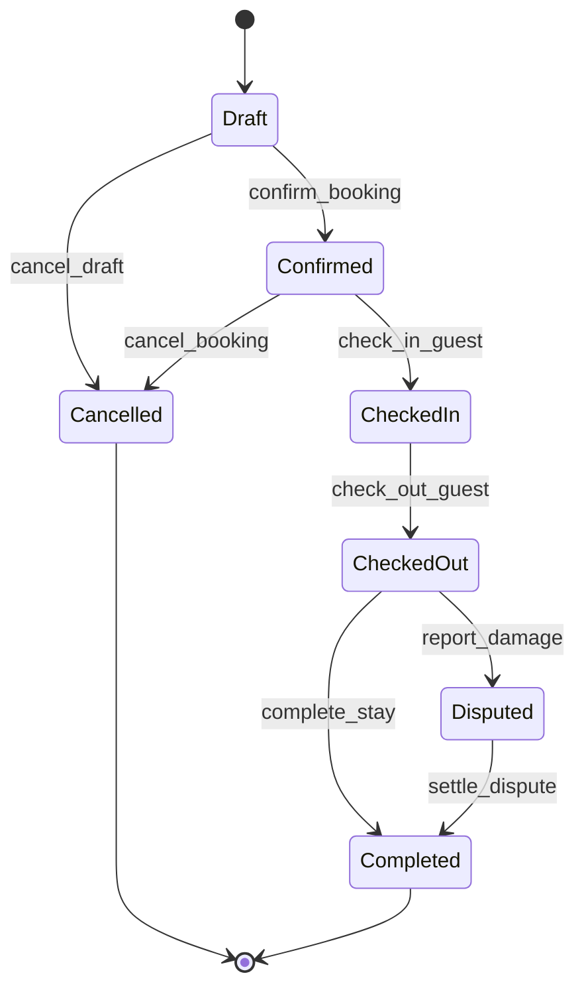
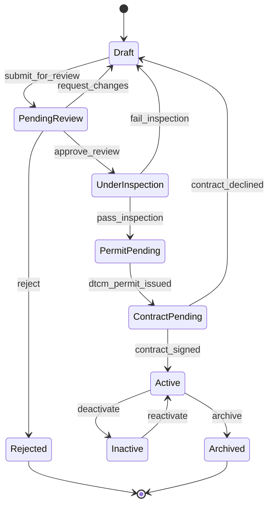
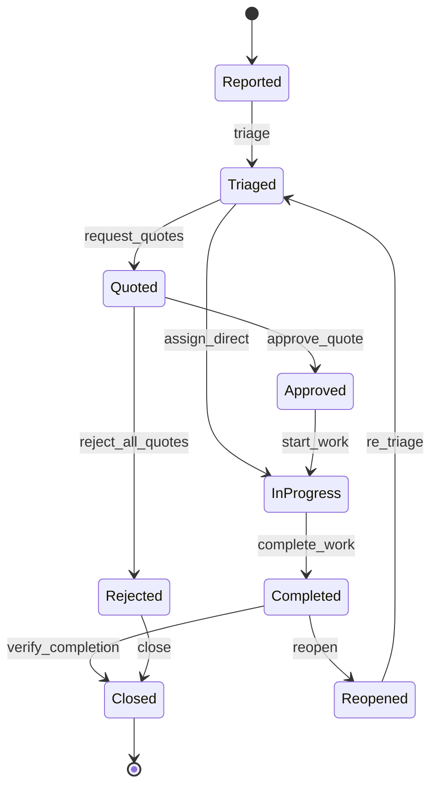
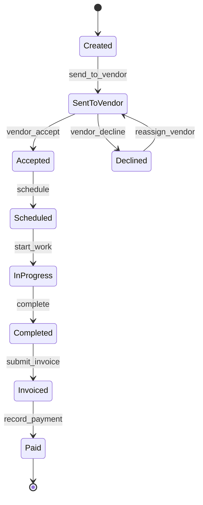
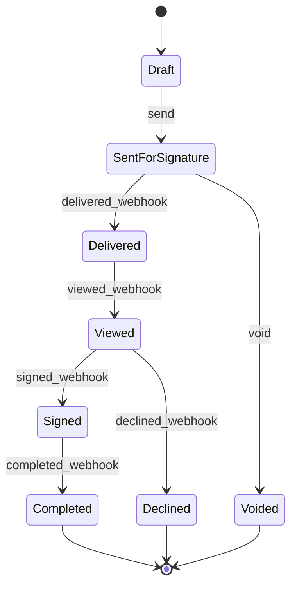
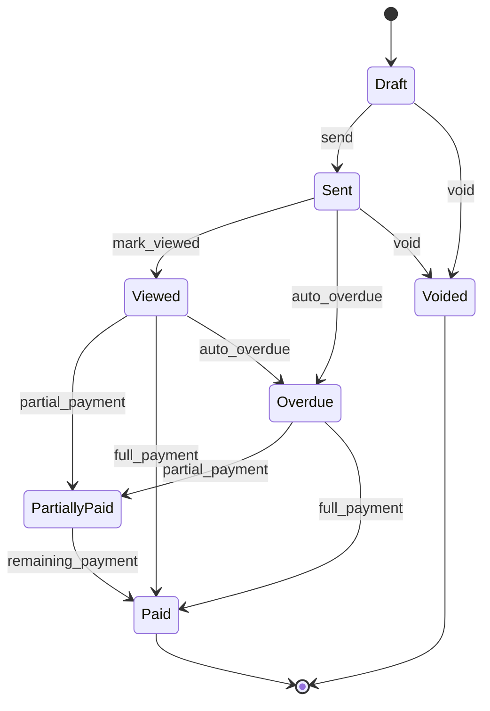

# Workflow Blueprint — Holiday Homes SaaS

> **Version**: 2.0  
> **Last Updated**: 2026-05-31  
> **Engine Pattern**: Finite State Machine with JSONB state definitions
> **Auth Context**: Custom session-based verification

---

## 1. Workflow Engine Architecture

The workflow engine is a **declarative state machine** driving operational transitions. Every transaction transition checks roles against our internal RBAC database.

```
┌─────────────────────────────────────────────────────────────┐
│                    WORKFLOW ENGINE                          │
│                                                             │
│  ┌──────────────┐   ┌──────────────┐   ┌──────────────┐  │
│  │  Definitions  │   │  Instances   │   │   History    │  │
│  │   (JSONB)    │──▶│  (Runtime)   │──▶│  (Audit)     │  │
│  └──────────────┘   └──────┬───────┘   └──────────────┘  │
│                            │                               │
│              ┌─────────────┼─────────────┐                │
│              │             │             │                 │
│         ┌────▼────┐  ┌────▼────┐  ┌────▼────┐           │
│         │ Guards  │  │ Effects │  │  Hooks  │           │
│         │(Perms)  │  │(Notifs) │  │(Custom) │           │
│         └─────────┘  └─────────┘  └─────────┘           │
└─────────────────────────────────────────────────────────────┘
```

---

## 2. Booking Lifecycle State Machine

Native reservations engine transitions. Bookings sync in real-time with Uplisting.



### State Definitions & Accounting Triggers

| State | Required Fields | Who Can Trigger Exit | Accounting Side Effect |
|-------|----------------|---------------------|------------------------|
| **Draft** | property_id, check_in, check_out, guest_id | PM, Guest | — |
| **Confirmed** | payment_reference, gross_amount, currency | PM, System | **Trust Receipt posted**: Debit `Trust Cash` and Credit `Guest Deposit Escrow` (Liability) + `Security Deposit Escrow` (Liability). |
| **Checked In** | check_in_timestamp | PM, Guest | — |
| **Checked Out**| check_out_timestamp | PM | **Trust Earnings Disbursement posted**: Debit `Guest Deposit Escrow`, Credit `Owner Escrow Payable` (Owner Share) + Credit `Operating Commission Revenue` (Mgmt Fee) + Credit `VAT Payable` (5% UAE VAT). |
| **Completed** | clearance_notes | PM, System (Auto-transition after 7 days) | **Deposit Release posted**: Debit `Security Deposit Escrow`, Credit `Trust Cash` (returned to guest). |
| **Disputed** | claim_id, damage_notes | PM | **Deposit Withheld posted**: Debit `Security Deposit Escrow`, Credit `Owner Escrow Payable` (reimbursed) or `Operating Revenue` (repair cost). |
| **Cancelled** | cancellation_reason | PM, System | **Refund posted**: Debit `Guest Deposit Escrow`, Credit `Trust Cash` (dependent on cancellation rules). |

### Channel Sync Side Effects (Uplisting)
1. **Outbound Sync**: Transition to `Confirmed` pushes calendar blocks to Uplisting via API (`POST /v1/reservations`) to block bookings across Airbnb, Booking.com, VRBO, etc.
2. **Inbound Webhook**: Incoming webhook notifications from Uplisting parse reservation changes and auto-trigger state shifts (e.g., guest cancels on Airbnb → webhook triggers transition to `Cancelled` in our DB).

---

## 3. Property Onboarding Workflow

In accordance with UAE tourism laws, each property is tracked as a single unit and requires DTCM permit approval.



### State Definitions

- **Draft**: Initial creation by Property Manager.
- **Pending Review**: PM submits unit. Minimum 3 photos, unit type, location, and owner linkage verified.
- **Under Inspection**: Operations coordinator verifies the physical state of the single unit.
- **Permit Pending**: Inspection passed. Dubai DTCM permit application submitted. Requires `dtcm_permit_number` and `dtcm_permit_expiry` to proceed.
- **Contract Pending**: DTCM permit active. Contract envelope generated and sent via DocuSign to the owner.
- **Active**: DocuSign webhook confirms signature completion. Property is marked active. Inventory calendar synced to Uplisting.
- **Inactive / Archived**: Property offline. Block calendars on Uplisting.

---

## 4. Maintenance Request Lifecycle

Tied to Property units and linked to our custom accounting ledger.



### State Definitions & Accounting Triggers

- **Reported**: Issue logged by guest, owner, or staff.
- **Triaged**: Coordinator assigns priority and categories.
- **Quoted**: Vendors upload quote amounts. If amount exceeds settings (`quote_approval_threshold`), Owner authorization request is dispatched.
- **Approved**: Quote approved. Work order created.
- **In Progress**: Work scheduled and active.
- **Completed**: Vendor uploads completion photos and submits invoice through the Vendor Portal.
- **Closed**: PM verifies completion. Trigger accounting entry: **Post Vendor Payable**: Debit `Maintenance Expense` (categorized to Property unit for NOI calculation), Credit `Accounts Payable (Vendor)`.

---

## 5. Work Order Lifecycle

Vendor tasks resulting from maintenance items.



### Side Effects & WhatsApp Logs
- **Sent to Vendor**: Dispatches outbound WhatsApp message with work order sheet.
- **Completed**: Sends PM notification and captures completion pictures.
- **Invoiced**: Creates draft Payable Invoice.
- **Paid**: Triggers disbursement payment log: Debit `Accounts Payable (Vendor)`, Credit `Trust/Operating Bank Cash`. Outbound WhatsApp message notifies vendor.

---

## 6. Document Signing (DocuSign Envelope Lifecycle)



### Webhook Action Mapping
- `envelope-completed` -> Update `owner_properties` schema, flag `is_signed = true`, store signed contract PDF in Cloudflare R2, transition property status to `Active`.

---

## 7. Invoicing & Payment Lifecycle

UAE VAT-compliant invoicing flow.



### Accounting Actions
- **Sent/Posted**: Debit `Accounts Receivable`, Credit `Revenue` (or `Owner Escrow Payable`), Credit `VAT Payable (5% UAE)`.
- **Payment Recorded**: Debit `Bank Account` (specific account based on operating/trust rule), Credit `Accounts Receivable`.
- **Auto-Overdue**: Triggered by daily cron check. Sends automated WhatsApp reminder to tenant/owner.
